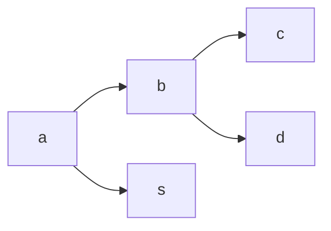
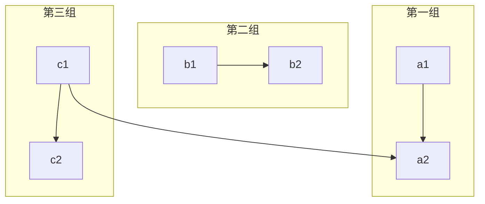
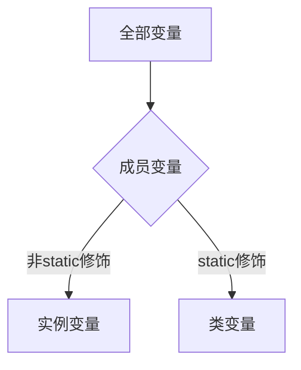
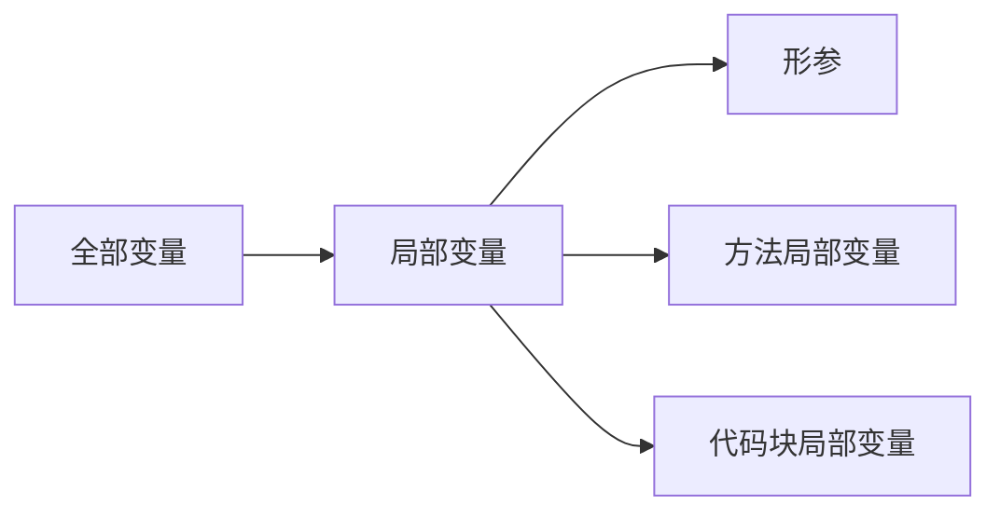
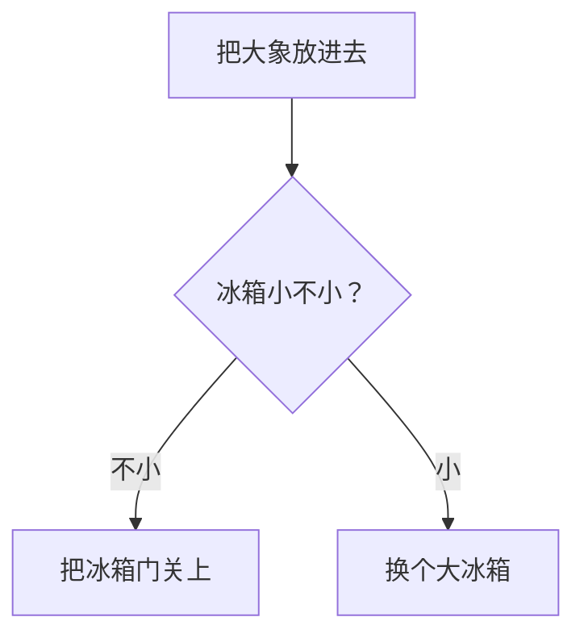
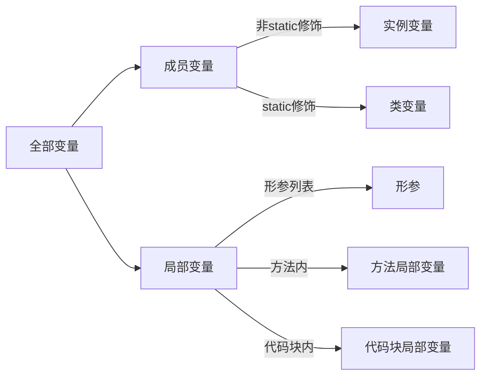

# 一级标题

## 二级标题

### 三级标题

正文：每个# 代表一级标题，总共有六级标题

*aaa* 代表斜体  `*aaa* `

**aaa** 代表加粗  `**aaa**`

***aaa*** 代表斜体和加粗  `***aaa***`

==aaa== 代表高亮 `==aaa==`

~~删除线~~ 使用两对波浪线  `~~删除线~~ `

### 首行缩进

&emsp;&emsp;首行缩进方法一：全角空格。&#8195;`&#8195;&#8195;` 等同 `&emsp;&emsp;`
&ensp;&ensp;&ensp;&ensp;首行缩进方法二：半角空格。&#8194;`&#8194;&#8194;&#8194;&#8194;` 等同 `&ensp;&ensp;&ensp;&ensp;`
&nbsp;&nbsp;&nbsp;&nbsp;&nbsp;&nbsp;&nbsp;首行缩进方法三：不换行空格。&#160;`&#160;&#160;&#160;&#160;&#160;&#160;&#160;` 等同 `&nbsp;&nbsp;&nbsp;&nbsp;&nbsp;&nbsp;&nbsp;`

* 注：中文首行段落缩进：两个全角空格 = 四个半角空格 = 7个不断行空格。

### 引用

>引用 
此处为引用内容`>引用`
>>嵌套引用
此处为嵌套引用 `>>嵌套引用`

###分割线
使用* 或 -来表示，如下：
`*** or ---`
***
---

### 列表

有序列表:
```markdown
1. 第一
2. 第二
   2.1 
   2.2
        2.2.1
        2.2.2
3. 第三
```
1. 第一
2. 第二
   2.1 
   2.2
        2.2.1
        2.2.2
3. 第三

无序列表
- abc
   - def
   - hi  
* abc

```markdown
- abc
   - def
   - hi  
* abc
```

### 插入链接

[链接名](https://www.bilibili.com/video/BV1si4y1472o?spm_id_from=333.337.search-card.all.click)

```markdown
[链接名](https://www.bilibili.com/video/BV1si4y1472o?spm_id_from=333.337.search-card.all.click)

```
[Markdown 官方教程](https://markdown.com.cn/basic-syntax/)

###插入图片
  
*label*

```markdown
  
*lable*
```

### 表格

| 姓名   |   年龄   |   性别 |
| :----- | :------: | -----: |
| 张三   |    22    |     男 |
| 李四   |    21    |     女 |
| 左对齐 | 居中对齐 | 右对齐 |
```markdown
| 姓名   |   年龄   |   性别 |
| :--- | :---: | ---: |
| 张三   |    22    |     男 |
| 李四   |    21    |     女 |
| 左对齐 | 居中对齐 | 右对齐 |

```

### 插入公式

[LaTeX数学表达式](https://math.meta.stackexchange.com/questions/5020/mathjax-basic-tutorial-and-quick-reference)
$$
\lim_{x \to \infin}\frac{\sin(x)}{x} = 1        \tag{公式1}
$$

$$
f=ax+b \tag{公式2}
$$


在文字中插入公式：$y=\log_a(x)$

#### 常用公式：

1. 求和：$\sum\to $`\sum`  ，效果演示：$\sum_{i=0}^n i^2 = \frac{(n^2+n)(2n+1)}{6}\to $`\sum_{i=0}^n i^2 = \frac{(n^2+n)(2n+1)}{6}`
2. 累乘：$\prod \to $`\prod`
3. 并集：$\bigcup\to $`\bigcup`
4. 交集：$\bigcap\to $`\bigcap`
5. 积分：$\int\to $`\int`、$\iint\to$`\iint`、$\iiint\to $`\iiint`
6. 分式：$\frac{a+1}{b+1}\to $`\frac{a+1}{b+1}`
7. 极限：$\lim_{x\to 0 \quad\to }$`\lim_{x\to 0}`
8.  特殊符号：$\sqrt x \to\quad$`$\sqrt x \to \quad$，其中\quad表示空格`，$\infty\to$`\infty`
9.  向量：$\vert x\vert \to $`\vert x \vert`，$\Vert x\Vert \to $`\Vert x\Vert`，$\langle x \rangle\to $`\langle x \rangle`，$\lceil x \rceil\to $`\lceil x \rceil`， $\lfloor x\rfloor\to$`\lfloor x\rfloor`，$\lbrace x\rbrace\to $`\lbrace x\rbrace`
10. $\overline a\to $`\overline a`，$\underline a\to $`\underline a`，$\widetilde a \to $`\widetilde a`，$\hat a \to $ `\hat a`， $\widehat a \to $`\widehat a`，$\fbox a \to $`\fbox a`，$\overrightarrow a \to $`\overrightarrow a`
11. 矩阵：
$$
\begin{matrix}
1 & x & x^2 \\
1 & y & y^2 \\
1 & z & z^2 \\
\end{matrix}
$$

```markdown
\begin{matrix}
1 & x & x^2 \\
1 & y & y^2 \\
1 & z & z^2 \\
\end{matrix}
```

$$
\left (
\begin{matrix}
1 & x & x^2 \\
1 & y & y^2 \\
1 & z & z^2 \\
\end{matrix}
\right )
$$

```markdown
\left (
\begin{matrix}
1 & x & x^2 \\
1 & y & y^2 \\
1 & z & z^2 \\
\end{matrix}
\right )
```

11. 公式：
$$
f(n) =
\begin{cases}
n/2,  & \text{if $n$ is even} \\
3n+1, & \text{if $n$ is odd}
\end{cases}
$$

```markdown
f(n) =
\begin{cases}
n/2,  & \text{if $n$ is even} \\
3n+1, & \text{if $n$ is odd}
\end{cases}
```

$$
\left.
\begin{array}{l}
\text{if $n$ is even:}&n/2\\
\text{if $n$ is odd:}&3n+1
\end{array}
\right\}
=f(n)
$$

```
\left.
\begin{array}{l}
\text{if $n$ is even:}&n/2\\
\text{if $n$ is odd:}&3n+1
\end{array}
\right\}
=f(n)       
其中\left.和\right\}表示左边不加,右边加}
```

### 数学符号

| 1          | 2             | 3         | 4         | 5         | 6        | 7           | 8        |
| ---------- | ------------- | --------- | --------- | --------- | -------- | ----------- | -------- |
| $\alpha$ `\alpha` | $\Alpha$ `\Alpha`  | $\beta$ `\beta`  | $\Beta$`\Beta`   | $\gamma$`\gamma`  | $\Gamma$`\Gamma` | $\delta$`\delta`    | $\Delta$ `\Delta`|
| $\epsilon$`\epsilon` | $\varepsilon$`\varepsilon` | $\zeta$ `\zeta `|$\eta$ `\eta`   | $\theta$`\theta`  | $\Theta$`\Theta` | $\vartheta$`\vartheta` | $\iota$`\iota`  |
| $\kappa$`\kappa`   | $\lambda$ `\lambda` | $\Lambda$`\Lambda` | $\mu$ `\mu`| $\nu$ `\nu`| $\xi$ `\xi`   | $\Xi$ `\Xi`| $\pi$`\pi` |
| $\Pi$ `\Pi`  | $\varpi$ `\varpi`  | $\rho$ `\rho`   | $\varrho$`\varrho` | $\sigma$  `\sigma`| $\Sigma$`\Sigma` | $\varsigma$`\varsigma` | $\tau$ `\tau`  |
| $\upsilon$`\upsilon` | $\Upsilon$`\Upsilon`    | $\phi$`\phi`    | $\Phi$`\Phi`    | $\varphi$ `\varphi`| $\chi$ `\chi`  | $\psi$ `\psi`     | $\Psi$`\Psi`   |
| $\Omega$`\Omega`   | $\omega$  `\omega`    |$\tau$ `\tau` |$\Tau$ `\Tau` 

### Emoji表情

:smile: :
[Emoji表情大全](https://gist.github.com/rxaviers/7360908)

### 代码

```java
public class MT{
    public static void main(){
        
    }
}
```
正文中的代码块：`print()`

### 注脚

此处需要注脚[^脚注]
`此处需要注脚[^注脚],在文本末尾标注：[^脚注]:要解释的内容`

[^脚注]: 要解释的内容


### 注释

此处需要注释，[^1]

[^1]:

### 目录生成

@[TOC](目录标题)
`@[TOC](目录标题)`

### 流程图











