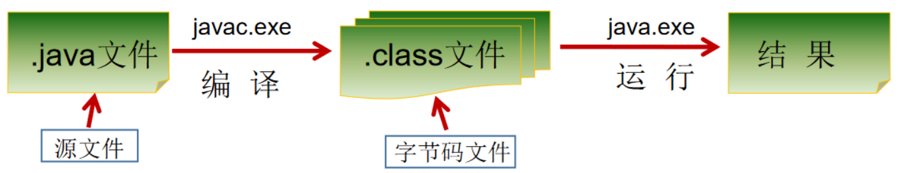

# javaSE

## 一、基础概念

### 1、Java语言概述
#### 1.1、软件开发介绍

* 软件开发：一系列按照特定顺序组织的计算机数据和指令的集合。软件有系统软件和应用软件之分。
* 人机交互方式：
  * 图形化界面(Graphical User Interface GUI)：这种方式简单直观，使用者易于接受，容易上手操作
  * 命令行方式(Command Line InterfaceCLI)：需要有一个控制台，输入特定的指令，让计算机完成一些操作。较为麻烦，需要记录住一些命令。
* 常用的DOS命令
  * ⊞+R，一起按下，输入cmd，可以打开dos界面。
  * dir :列出当前目录下的文件以及文件夹
  * md :创建目录
  * rd :删除目录
  * cd :进入指定目录
  * cd… : 退回到上一级目录
  * del :删除文件
  * exit : 退出dos 命令行
  * 常用快捷键
    * ← →：移动光标
    * ↑↓：调阅历史操作命令
    * Delete和Backspace：删除字符
  * 注意：在输入dos命令时，要是用英文输入，所有标点符号都是英文。

#### 1.2、计算机编程语言介绍
* 计算机语言：人与计算机交流的方式。如果人要与计算机交流，那么就要学习计算机语言。计算机语言有很多种，如：C，C++，Java，PHP，Kotlin，Python，Scala等。
* 第一代语言
    * 机器语言：指令以二进制代码形式存在。
* 第二代语言
    * 汇编语言：使用助记符表示一条机器指令。
* 第三代语言：
  * 高级语言：
    * C、Pascal、Fortran面向过程的语言
    * C++面向过程/面向对象
    * Java跨平台的纯面向对象的语言
    * .NET跨语言的平台
    * Python、Scala…
#### 1.3、Java语言概述
* java是SUN(Stanford University Network，斯坦福大学网络公司) 1995年推出的一门高级编程语言。
* Java简史
  * 1991年，Green项目，开发语言最初命名为Oak (橡树)
  * 1994年，开发组意识到Oak 非常适合于互联网
  * 1996年，发布JDK 1.0，约8.3万个网页应用Java技术来制作
  * 1997年，发布JDK 1.1，JavaOne会议召开，创当时全球同类会议规模之最
  * 1998年，发布JDK 1.2，同年发布企业平台J2EE
  * 1999年，Java分成J2SE、J2EE和J2ME，JSP/Servlet技术诞生
  * 2004年，发布里程碑式版本：JDK 1.5，**为突出此版本的重要性，更名为JDK 5.0**
  * 2005年，J2SE -> JavaSE，J2EE -> JavaEE，J2ME -> JavaME
  * 2009年，Oracle公司收购SUN，交易价格74亿美元
  * 2011年，发布JDK 7.0
  * 2014年，发布**JDK 8.0，是继JDK 5.0以来变化最大的版本**
  * 2017年，发布JDK 9.0，最大限度实现模块化
  * 2018年3月，发布JDK 10.0，版本号也称为18.3
  * 2018年9月，发布JDK 11.0，版本号也称为18.9
  * 2019年3月20日，Java SE 12 发布。Java 12是短期支持版本。
  * 2019年9月23日，Java SE 13发布，此版本中添加了“文本块”，文本块是一个多行字符串文字，避免对大多数转义序列的需要，以可预测的方式自动格式化字符串，并在需要时让开发人员控制格式。
* Java技术体系平台
  * JavaSE(Java Standard Edition)标准版：
    
    >支持面向桌面级应用（如Windows下的应用程序）的Java平台，提供了完整的Java核心API，此版本以前称为J2SE。
  * JavaEE(Java Enterprise Edition)企业版：
    
    >是为开发企业环境下的应用程序提供的一套解决方案。该技术体系中包含的技术如:Servlet 、Jsp等，主要针对于Web应用程序开发。版本以前称为J2EE。
  * Java ME(Java Micro Edition)小型版:
    
    >支持Java程序运行在移动终端（手机、PDA）上的平台，对Java API有所精简，并加入了针对移动终端的支持，此版本以前称为J2ME。
#### 1.4、Java程序运行机制及运行过程
* Java特点：
  * 特点一：面向对象
    * 两个基本概念：类、对象
    * 三大特性：封装、继承、多态
  * 特点二：健壮性
    * 吸收了C/C++语言的优点，但去掉了其影响程序健壮性的部分（如指针、内存的申请与释放等），提供了一个相对安全的内存管理和访问机制。
  * 特点三：跨平台性
    * 跨平台性：通过Java语言编写的应用程序在不同的系统平台上都可以运行。“Write once , Run Anywhere”
    * 原理：只要在需要运行java 应用程序的操作系统上，先安装一个Java虚拟机(JVM Java Virtual Machine) 即可。由JVM来负责Java程序在该系统中的运行。
* Java两种核心机制
  * Java虚拟机(Java VirtalMachine)
  * 垃圾收集机制(Garbage Collection)
#### 1.5、Java语言的环境搭建
* JDK(Java Development Kit——Java开发工具包)
    * JDK是提供给Java开发人员使用的，其中包含了**java开发工具**、**JRE**。所以安装了JDK就不用在单独安装JRE了。其中的开发工具：编译工具(javac.exe)、打包工具(jar.exe)等。
* JRE(Java Runtime Environment——Java运行环境)
  * 包括Java虚拟机(JVM Java Virtual Machine)和Java程序所需的核心类库等，如果想要运行一个开发好的Java程序，计算机中只需要安装JRE即可。
>总的来说：
  JDK = JRE + 开发工具集（例如Javac编译工具等）
  JRE = JVM + Java SE标准类库 

#### 1.6、开发体验—HelloWorld
* 第一个Java程序：在**Test.java** 的文件中编写如下代码，通过**javac**命令对该java文件进行编译，在当前目录下会出现一个**Test.class**文件，该文件称为字节码文件，最后通过**java**命令对生成的class文件进行运行。
  ```java
  public class Test{
    public static void main(String[] args) {
        System.out.println("hello world");
    }
  } 
  ```
  
#### 1.7、注释(comment)
* Java中的注释类型：
    * 单行注释
        * 格式：`//注释的信息，单行`
    * 多行注释
        * 格式：`/*注释的信息，可换行*/`
        * 注意：对于单行和多行注释，被注释的文字，不会被JVM（java虚拟机）解释执行。
        * 多行注释里面不允许有多行注释嵌套。
    * 文档注释(java特有)
        * 格式：
        ```java
        /**
        @author  指定java程序的作者
        @version  指定源文件的版本
        */
        ```
        * 注意：注释内容可以被JDK提供的工具javadoc所解析，生成一套以网页文件形式体现的该程序的说明文档。
#### 1.8、小结
* Java源文件以"java"为扩展名。源文件的基本组成部分是类(class)，如本例中Test类。
* Java应用程序的执行入口是main()方法。它有固定的书写格式：
`public static void main(String[] args) {…}`
* Java语言严格区分大小写。
* Java方法由一条条语句构成，每个语句以";"结束。
* 大括号都是成对出现的，缺一不可。
* 一个源文件中最多只能有一个public类。其它类的个数不限，如果源文件包含一个public类，则文件名必须按该类名命名。

### 2、变量、标识符、保留字
#### 2.1、关键字与保留字
* 关键字(keyword)
  * 定义：被 Java 语言赋予了特殊含义，用做专门用途的字符串（单词）。
  * 特点：关键字中所有字母都为小写。
  * 官方链接：[https://docs.oracle.com/javase/tutorial/java/nutsandbolts/_keywords.html](https://docs.oracle.com/javase/tutorial/java/nutsandbolts/_keywords.html)
* 保留字(reserved word)
  * 现有 Java 版本尚未使用，但以后版本可能会作为关键字使用。自己命名标识符时要避免使用这些保留字，如：goto、const。
#### 2.2、标识符
* 标识符定义：Java 对各种变量、方法和类等命名时使用的字符序列称为标识符。
* 命名标识符规则：
  * 由 26 个英文字母大小写，0-9，_或$ 组成。
  * 数字不可以开头。
  * 标识符不能包含空格。
  * 不可以使用关键字和保留字，但能包含关键字和保留字。
  * Java 中严格区分大小写，长度无限制。
* 名称命名规范：
  * 包名：多单词组成时所有字母都小写：xxxyyyzzz
  * 类名、接口名：多单词组成时，所有单词的首字母大写：XxxYyyZzz
  * 变量名、方法名：多单词组成时，第一个单词首字母小写，第二个单词开始每个单词首字母大写：xxxYyyZzz
  * 常量名：所有字母都大写。多单词时每个单词用下划线连接：XXX_YYY_ZZZ
#### 2.3、变量
##### 变量的声明与使用

  * 声明格式：`<数据类型> <变量名> = <初始化值>;`
  * 变量分类：
    * 在方法体外，类体内声明的变量称为**成员变量**。
    * 在方法体内部声明的变量称为**局部变量**。
    ```mermaid
      graph LR
      A[全部变量] --> B[成员变量]
      B -->|非static修饰| C[实例变量]
      B -->|static修饰| D[类变量]
    
      A-->E[局部变量]
      E -->|形参列表| F[形参]
      E -->|方法内| G[方法局部变量]
      E -->|代码块内| H[代码块局部变量]   
    ```
##### 基本数据类型

   ```mermaid
    graph LR
    A[数据类型] --> B[基本数据类型:primitive type]
    A[数据类型] --> C[引用数据类型:reference type]
    B --> D[数值型]
    D --> E[整数类型:byte,short,int,long]
    D --> F[浮点类型:fload,double]
    B --> G[字符类型:char]
    B --> H[布尔类型:boolean]
    C --> I[数组:Array]
    C --> J[类:class]
    C --> K[接口:interface]
   ```
  * 整数类型(byte、short、int、long)
    * java的整型常量默认为 int 型；声明 long 型常量，须后加‘l’或‘L’。
      类型|存储空间|表示范围
      :---:|:---:|:---:
      byte|1字节(8bit)|-128 ~ 127
      short|2字节|-2^15 ~ 2^15-1
      int|4字节|-2^31 ~ 2^31-1
      long|8字节|-2^63 ~ 2^63-1
    >bit: 计算机中的最小存储单位；byte:计算机中基本存储单元。
  * 浮点类型(float、double)
    * Java的浮点型常量默认为 double 型；声明float型常量，须后加‘f’或‘F’。
      类型|存储空间|表示范围
      :---:|:---:|:---:
      float|4字节|-3.403E38 ~ 3.403E38
      double|8字节|-1.798E308 ~ 1.798E308
  * 字符类型(char)
    * char型数据用来表示通常意义上“字符”(2字节)。
    * 声明char型变量，通常使用一对''单引号。
    * Java中还允许使用转义字符。
  * 布尔类型(boolean)
    * boolean类型用来判断逻辑条件，一般用于程序流程控制。
    * boolean类型数据只允许取值true和false，无null。
* 基本数据类型转换
  * 自动类型转换：容量小的类型自动转换为容量大的数据类型。
  * byte,short,char之间不会相互转换，他们三者在计算时首先转换为int类型。
  * boolean类型不能与其它数据类型运算。
  * 和String进行连接运算(+)时，基本数据类型的值将自动转化为String类型。
* 字符串类型
  * String不是基本数据类型，属于引用数据类型。
  * 声明String类型变量时，使用一对""双引号。
  ```java
  String str1 = 4; //判断对错：no
  String str2 = 3.5f + “”; //判断str2对错：yes
  System.out.println(str2); //输出：”3.5”
  System.out.println(3+4+“Hello!”); //输出：7Hello!
  System.out.println(“Hello!”+3+4); //输出：Hello!34
  System.out.println(‘a’+1+“Hello!”); //输出：98Hello!
  System.out.println(“Hello”+‘a’+1); //输出：Helloa1
  ```
* 强制类型转换
  * 强制转换符：()，但可能造成精度降低或溢出,格外要注意。
  * 通常，字符串不能直接转换为基本类型，但通过基本类型对应的**包装类**则可以实现把字符串转换成基本类型。
  * boolean类型不可以转换为其它的数据类型。
#### 2.4、进制
* 进制类型
  * 二进制(binary)：0,1 ，满2进1.以0b或0B开头。
    
    >二进制的整数有如下三种形式：
    >- **原码**：直接将一个数值换成二进制数，最高位是符号位。
    >- **反码**：负数是对原码按位取反，只是符号位不变，为1；正数为其自身。
    >- **补码**：负数是其反码加1；正数为其本身。
  * 十进制(decimal)：0-9 ，满10进1。
  * 八进制(octal)：0-7 ，满8进1. 以数字0开头表示。
  * 十六进制(hex)：0-9及A-F，满16进1，以0x或0X开头表示。此处的A-F不区分大小写。如：0x21AF +1= 0X21B0
  
* 进制间的转换

	* 十进制$\to$二进制：
	  * 整数部分：除2取余倒序排列
	  * 小数部分：乘2取整正序排列
	* 二进制$\to$十进制：乘以对应的2 的幂次

### 3、运算符

#### 3.1运算符

- 算数运算符
  运算符|运算|示范|结果
  :---:|:---:|:---:|:---:
  `+`|加\正号\字符串连接|+3|3
  `-`|减\负号|a=4;-a|-4
  `*`|乘|3*4|12
  `/`|除|12/4|3
  `%`|取模|7%5|2
  `++`|前加加：先运算后取值|a=2;b=++a|b=3;a=3
  `++`|后加加：先取值后运算|a=2;b=a++|b=2;a=3
  `--`|前减减：先取值后运算|a=2;b=--a|b=1;a=1
  `--`|后减减：先取值后运算|a=2;b=a--|b=2;a=1
  
- 赋值运算符

	- 符号：`=`
	- 扩展赋值运算符：`+=, -=, *=, /=, %=`

- 比较运算符
  运算符|运算|示范|结果
  :---:|:---:|:---:|:---:
  `==`|相等于|4==3|false
  `!=`|不等于|4!=3|true
  `<`|小于|4<3|false
  `>`|大于|4>3|true
  `<=`|小于等于|4<=3|false
  `>=`|大于等于|4>=3|true
  `instanceof`|检查是否是类的对象|"hi" instanceof String|true

- 逻辑运算符
  符号|a=true;b=true|a=true;b=false|a=false;b=true|a=false;b=false
  :---:|:---:|:---:|:---:|:---:
  `a&b-逻辑与`|true|false|false|false
  `a&&b-短路与`|true|false|false|false
  `a|b-逻辑或`|true|true|true|false
  `a||b-短路或`|true|true|true|false
  `!a-非`|false|false|true|true
  `a^b-异或`|false|true|true|false
  >`&` 与 `&&`的区别：
  >- 单`&`：左边无论真假，右边都进行运算；
  >- 双`&`：如果左边为真，右边参与运算，如果左边为假，那么右边不参与运算。
  >- `||`与`|`的关系与上同理。
  
- 位运算符
  运算符|运算|示例|结果
  :---:|:---:|:---:|:---:
  `<<`|左移|`3<<2`|3×2×2=12
  `>>`|右移|`3>>1`|3/2=1
  `>>>`|无符号右移|`3>>>1`|3/2=1
  `&`|按二进制位进行与运算|`6&3`|2
  `|`|按二进制位进行或运算|`6|3`|7
  `^`|异或运算|`6|3`|5
  `~`|取反运算|`~6`|-7
  
- 三元运算符

	- 格式：`(条件表达式)?表达式1：表达式2；`
	- 判断：条件表达式为true，运算结果是表达式1；条件表达式为false，运算结果是表达式2。


#### 3.2运算符优先级

### 4、程序流程控制

## 二、数组Array

## 三、面向对象

## 四、异常处理

## 五、多线程

## 六、Java常用类
### 1、字符串相关类
### 2、日期相关类
### 3、java比较器
### 4、System类
### 5、Math类
### 6、BigInteger、BigDecimal

## 七、枚举类

## 八、注解

## 九、集合

## 十、泛型

## 十一、IO流

## 十二、网络编程

## 十三、反射动态代理

## 十四、新特性

### 1、Java8新特性

#### 1.1 Lambda表达式

- Lambda 是一个匿名函数，我们可以把Lambda理解为是一段可以传递的代码（将代码像数据一样进行传递）。使用它可以写出更简洁、更灵活的代码。

- Lambda表达式的本质：**作为接口的实例**；接口的要求——函数式接口。

- Lambda表达式使用举例
  ```java
  //实例1
  @Test
  public void test(){
		//实现Runnable接口的匿名类，重写run()
		Runnable r1 = new Runnable() {
			@Override
			public void run() {
				System.out.println("长安欢迎您");
			}
		};
		r1.run();
  
		System.out.println("+++++++++++++++++++++++++");
		//使用Lambda表达式改进
		Runnable r2 = () -> System.out.println("长安欢迎您");
  
		r2.run();
  }
  
  //实例2
  @Test
  public void test2(){
      //Comparator接口匿名实现类，重写compare()
      Comparator<Integer> c1 = new Comparator<Integer>() {
          @Override
          public int compare(Integer o1, Integer o2) {
              return Integer.compare(o1,o2);
          }
      };
      int compare1 = c1.compare(8,16);
      System.out.println(compare1);
  
      System.out.println("+++++++++++++++++++++++");
  
      //Lambda表达式的写法
      Comparator<Integer> c2 = (o1,o2) -> Integer.compare(o1,o2);
  
      int compare2 = c2.compare(28,35);
      System.out.println(compare2);
  
      System.out.println("+++++++++++++++++++++++++++");
      //方法引用
      Comparator<Integer> c3 = Integer :: compare;
  
      int compare3 = c3.compare(28,35);
      System.out.println(compare3);
  }
  ```
  
- Lambda表达式语法的使用
    - 举例： `(o1,o2) -> Integer.compare(o1,o2);`
    
    - 格式：
        `->` ：lambda操作符
        `->`左边：lambda形参列表 （其实就是接口中的抽象方法的形参列表）
        `->`右边：lambda体 （其实就是重写的抽象方法的方法体）
        
    - Lambda表达式的使用：分为6种情况介绍
    
        - 语法格式1：无参、无返回值
            ```java
            Runnable r1 = ()->{
                System.out.println("Hello Lambda");
            };
            ```
        
        - 语法格式2：Lambda需要一个参数，无返回值
            ```Java
            Consumer<String> con = (String str)->{
                System.out.println(str);
            }; 
            ```
        
        - 语法格式3：数据类型可省略，因为可有编译器推断出，称为“类型推断”
        
            ```java
            Consumer<String> con = (str)->{
                System.out.println(str);
            }; 
            ```
        
        - 语法格式4：Lambda只需一个参数时，参数的小括号可以省略
        
            ```java
            Consumer<String> con = str->{
                System.out.println(str);
            }; 
            ```
        
        -  语法格式5：Lambda需要两个及以上的参数，多条执行语句，可以有返回值
        
            ```java
            Comparator<Integer> com = (x,y)->{
                System.out.println("实现函数式接口方法！");
                return Integer.Compare(x,y);
            };
            ```
        
        - 语法格式6：Lambda体只有一条语句时，return与大括号若有，都可以省略
        
            ```Java 
            Comparator<Integer> com = (x,y)->Integer.compare(x,y); 
            ```

#### 1.2 函数式(Functional)接口

- 什么是函数式接口：只包含一个抽象方法的接口，成为函数式接口。

- 我们可以在一个接口上使用 `@FunctionalInterface` 注解，这样做可以检查它是否是一个函数式接口。

- `java.util.function`包下定义了Java 8 丰富的函数式接口：

	| 函数式接口 | 参数类型 | 返回类型 | 用途 |
	| :--------: | :------: | :------: | ---- |
	|            |          |          |      |
	|            |          |          |      |
	|            |          |          |      |

#### 1.3 方法引用与构造器引用

#### 1.4 Stream API

#### 1.5 Optional类